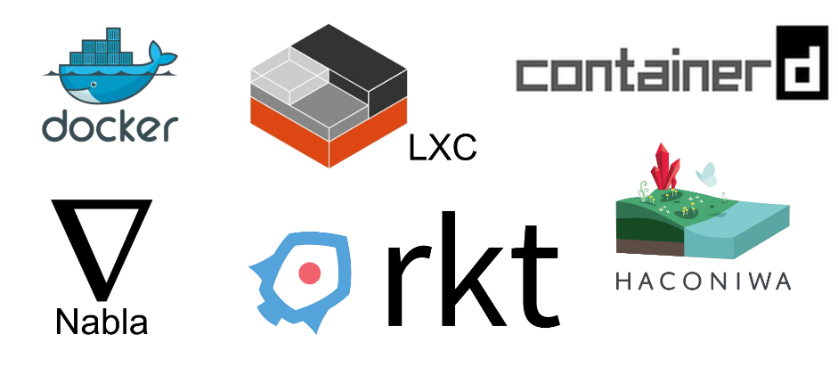

@snap[north-west span-30]

@snapend

@snap[north-east span-60]
居石峻寛 (Oriishi Takahiro)  
徳島大学大学院 M1
阿南高専プロコン部OB
最近はクラウド中心
@snapend

--- 

## Dockerで加速する
## ステートレスな
## アプリケーション実行環境

---  

#### アジェンダ

- Dockerって何?
- Dockerのメリット/デメリット
- Dockerの使い方
- Dockerを使う上で気をつけること
- Dockerおよびコンテナをとりまく環境

--- 

#### Dockerって何?

---  
#### Dockerとは

Linuxコンテナの  
管理ツール/エコシステム  

- コンテナライフサイクルの管理
- Docker CLIによる管理操作の簡易化
- Dockerfileによるコンテナ環境の作成，配付
- Docker RegistryによるDocker Imageの共有

--- 
#### 仮想環境環境

VM(Virtual Machine)とLinuxコンテナが主要  
アプリケーションやその実行環境を移植するための技術  

導入メリットは

- 開発環境と本番環境の差分を埋める
- メンバー間で開発環境の差分を埋める
- 環境構築の手間を削減

---  
##### VM

ハイパーバイザ(およびホストOS)が  
ハードウェアをエミュレートしゲストOSへ提供  

- ゲストOSへハードウェアへのインターフェイスを提供
- ゲストOSは通常のISOファイルを用いてインストール
- VirtualBoxやVMwareなど実装は様々で，  
  それぞれイメージファイルという形で管理

---  
##### Linuxコンテナ

ホストOSがハードウェアをエミュレートせず  
各種リソースを分離しコンテナへ提供  

- 実態は論理的に分割されたリソース  
  (プロセス，CPU，ディレクトリ構造etc...)
- 1コンテナ1プロセスが原則
- プロセスなどコンテナリソースはホストOSから確認可能
- カーネルがホストOSと共有  
  (カーネルパラメタ変更などはコンテナから実行不可)  

---  
##### Linuxコンテナの仮想化手法

以下のLinux組み込み機能を用いリソースを隔離  

- namesace (ネットワーク，プロセス，ユーザetc...)
- chroot (ディレクトリツリー)
- cgroup (仮想CPU/メモリなどのシステムリソース)
- capabilities (システムコールへのアクセス権限)

---
#### Linuxコンテナ管理ツール

