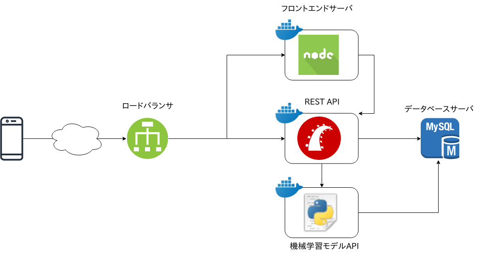
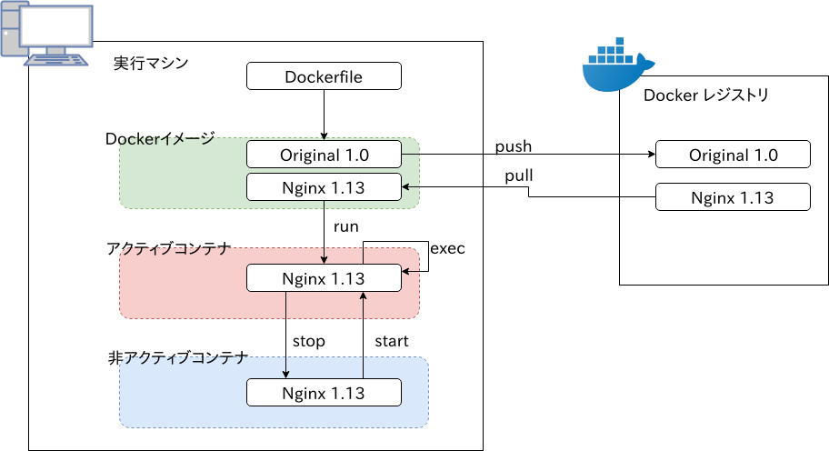

@snap[west span-30]

@snapend

@snap[east span-60]

居石峻寛 (Oriishi Takahiro)  

<ul>
 <li>徳島大学大学院 M1  
 <li>阿南高専プロコン部OB  
 <li>宗教は vim, i3-wm  
 <li>Haskellの文法はふつくしい...  
 <li>最近の興味はクラウド中心  
</ul>

@snapend

---

## Linuxコンテナで加速する
## ステートレスな
## アプリケーション実行環境

---  
#### 仮想環境環境

VM(Virtual Machine)とLinuxコンテナが主要  
アプリケーションやその実行環境を移植するための技術  

導入メリットは

- 開発環境と本番環境の差分を埋める
- メンバー間で開発環境の差分を埋める
- 環境構築の手間を削減

---  
##### VM

ハイパーバイザ(およびホストOS)が  
ハードウェアをエミュレートしゲストOSへ提供  

- ゲストOSへハードウェアへのインターフェイスを提供
- ゲストOSは通常のISOファイルを用いてインストール
- VirtualBoxやVMwareなど実装は様々で，  
  それぞれイメージファイルという形で管理

---  
##### Linuxコンテナ

ホストOSがハードウェアをエミュレートせず  
各種リソースを分離しコンテナへ提供  

- 実態は論理的に分割されたリソース  
  (プロセス，CPU，ディレクトリ構造etc...)
- 1コンテナ1プロセスが原則
- プロセスなどコンテナリソースはホストOSから確認可能
- カーネルがホストOSと共有  
  (カーネルパラメタ変更などはコンテナから実行不可)  

---  
##### Linuxコンテナの仮想化手法

以下のLinux組み込み機能を用いリソースを隔離  

- namesace (ネットワーク，プロセス，ユーザetc...)
- chroot (ディレクトリツリー)
- cgroup (仮想CPU/メモリなどのシステムリソース)
- capabilities (システムコールへのアクセス権限)

---
#### Linuxコンテナのメリット

- ホストのリソースを分離しているだけ  
  → VMに比べて起動が早い
- カーネルやデバイスドライバのエミュレートを行わない  
  → VMに比べて軽量，ハードウェアリソースの有効活用

---
#### Linuxコンテナのデメリット

- カーネルやハードウェアに関するチューニングができない
- ホストOSとの分離がVMより弱く，  
  脆弱性がホストへ影響を及ぼしやすい

---
#### 主な用途

- マイクロサービスアーキテクチャ  
  → 1コンテナ1サーバ/ミドルウェア
- Webサーバのステートレス化
- Caas (Container as a Service)
    + GCE(Google Container Engine)
    + AWS ECS (Elastic Container Service) etc...

---
#### こんな感じ

---
#### まとめ

- DockerはVMよりも軽量，ただしVMの上位互換ではない
- 流行りのマイクロサービスアーキテクチャと相性抜群
- DBやキャッシュなどのステートフルな部分ではなく，  
  APIサーバなどステートレスな部分での利用が適する

---
### 次の発表ではDockerを始める前に
### 知ってほしいことをしゃべります！

---

## Dockerへの準備

---

#### Dockerとは?

Linuxコンテナの  
管理ツール/エコシステム  

- コンテナライフサイクルの管理
- Docker CLIによる管理操作の簡易化
- Dockerfileによるコンテナ環境の作成，配付
- Docker RegistryによるDocker Imageの共有

--- 
#### Linuxコンテナ管理ツール群

---

#### なぜDockerを紹介?

おそらく一番普及しているLinuxコンテナ管理ツール

- ドキュメントの充実
- 様々なツールによるサポート
- Docker for windowsやDocker for macOSが提供  
  (VM上でLinuxを起動)

---

### Dockerがやっていることを知る

---
#### Dockerのアーキテクチャ

@size[10px](アーキテクチャの理解 http://docs.docker.jp/v1.11/engine/understanding-docker.html より引用)

---
#### Dockerのライフサイクル

---
### デモでDockerの雰囲気を
### 掴んでもらいます！

---
#### Dockerfileの例
+++?code=./src/Dockerfile
@[1](ベースとなるイメージ)
@[3](ソースファイルの追加)
@[5](環境変数HOGEの設定)
@[7](作業ディレクトリの指定)
@[8-13](コマンドを実行して環境を作成)
@[15](実行ユーザを変更)
@[17](コンテナ実行時のコマンドを指定)

---
#### サーバアプリケーション
+++?code=./src/app/server.go
@[11-17](環境変数HOGEと現在時刻をレスポンスに書き込む)

---
#### コマンド
+++?code=./src/cmdlist.sh

---
#### セキュリティ上のチェック

- イメージのDockerfileは公開されているか?
- 実行ユーザはroot以外に設定されているか?
- /etc/var/dcker.sockは  
  コンテナにマウントされていないか?

---
### Dockerをはじめて快適な開発を！
